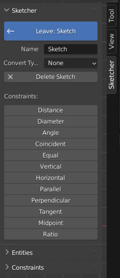
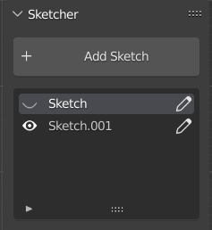
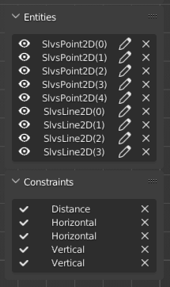
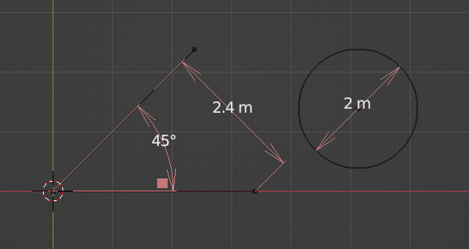
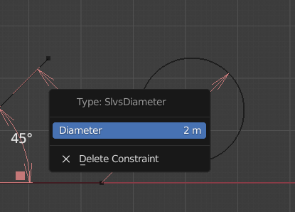
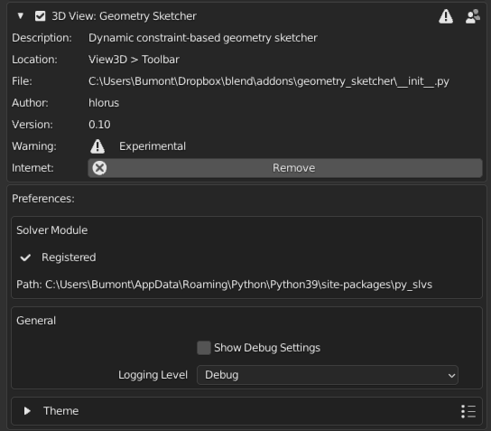
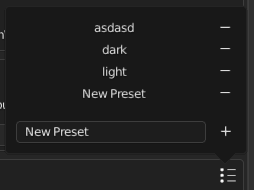

## Sidebar
{style="width:200px; height:220px; object-fit:cover;" align=right}

The addon adds a some panels to the "N"-sidebar under the category "Sketcher". From
here you can set the active sketch, access it's properties, add constraints and
interact with elements via the browsers.
{style="display:block; height:220px"}


### Sketch Selector
{align=right style="width:200px;"}

Whenever no sketch is active the sidebar will list all available sketches. From there
you can toogle the visibility of the sketches or set one as active. The UI will change
when a sketch is active, showing a big blue button which lets you exit the sketch as well as
some properties of that sketch.
{style="display:block; height:220px"}

### Entity Browser
{align=right style="width:200px"}

Lists all currently [active entities](entities.md#active). Allows selection by
clicking on the name.

### Constraint Browser
Lists all currently [active constraints](constraints.md#active). Shows the failure
state on the left and allows to invoke the constraint's context menu.
{style="display:block; height:200px"}

## Gizmos
Gizmos are used to display constraints. There are specific gizmo
types for the three dimensional constraints, angle, distance and diameter.

To interact with the settings of a constraint click it's gizmo to open a menu.
{align=left style="height:300px; width:calc(65% - 1em); object-fit:cover;"}
{align=right style="height:300px; width:calc(35% - 1em); object-fit:cover;"}

The rest of the constraints use a generic gizmo that is displayed next to the entities
they depend on. Clicking such a gizmo either shows the constraint's settings or directly
delets the constraint if it has no settings to show.

<!-- TODO: image -->


## Context Menu
The context menu can be used to access properties and actions of an element, either
by hovering an entity and pressing the right mouse button, by clicking a constraint
gizmo that supports it or through the corresponding button in one of the element browsers.

> **INFO:** Only the hovered entity is used, the context menu ignores the selection.

## Preferences
Access the preferences by expanding the enabled addon under
Edit > Preferences > Add-ons > CAD Sketcher.

{align=left style="height:300px; width:calc(50% - 1em); object-fit:cover;"}
{align=right style="height:300px; width:calc(50% - 1em); object-fit:cover;"}

### Solver Module
Shows either the path to the registered solver module or options to install it.

### General
- By enabling "Show Debug Settings" some experimental features are enabled, use
with caution.
- Choose the logging settings

### Theme
{align=right}

Colors that are used in the addon are defined under the theme section. The addon also
supports theme presets. You can get the presets path by entering the following line into blenders python console:

``` py
bpy.utils.user_resource("SCRIPTS")
```
